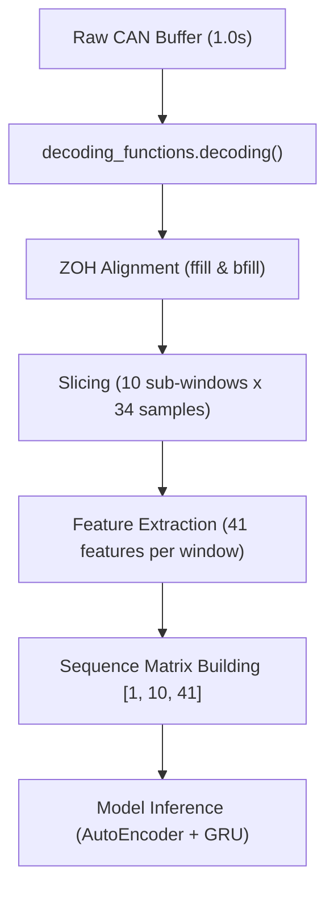

# Real-Time HW Module Integration Guide

본 가이드는 실시간 CAN 수집 모듈인 HW와 오프라인 학습 파이프라인인 ver2 모델 간의 통합 아키텍처 및 세부 정합 규격을 정의합니다.

## 0. 전체 사용 방법 (System Usage Guide)

### 0.1 오프라인 파이프라인 가동 순서 (Offline Pipeline Execution)

전체 데이터셋 구축 및 모델 학습을 위해 터미널에서 다음 명령어를 순차적으로 실행합니다. 모든 스크립트는 프로젝트 root 디렉토리에서 실행하며, 결과물은 자동으로 `results/` 폴더에 생성됩니다.

1. **1단계: Raw CSV CAN Decoding**
   ```bash
   python data/raw_decoded_ver2/src/decode_raw_csv_to_official_csv_ver2.py
   ```
2. **2단계: CAN Windowing (34 samples 및 Time columns 생성)**
   ```bash
   python data/raw_decoded_ver2/src/build_unified_can_context_csv_ver2.py
   ```
3. **3단계: Audio BPF Filtering & Feature extraction**
   ```bash
   python data/raw_decoded_ver2/src/build_standalone_audio_context_dataset_ver2.py
   ```
4. **4단계: Multimodal Fusion dataset 생성 (w34)**
   ```bash
   python data/raw_decoded_ver2/src/build_unified_multimodal_fusion_dataset_ver2.py
   ```
5. **5단계: 모델 학습 및 교차 검증 (sequence length = 10)**
   ```bash
   python data/raw_decoded_ver2/src/train_unified_models_ver2.py
   ```
6. **6단계: 4대 융합 및 Fail-Safe 비교 평가**
   ```bash
   python data/raw_decoded_ver2/src/experiment_multimodal_fusion_strategies_ver2.py
   ```

* **오디오가 없는 경우 (CAN 단독 학습 - CAN-Only Training)**:
  마이크 센서 전처리를 건너뛰고 CAN 데이터로만 학습하려면, 2단계 완료 후 `train_unified_models_ver2.py`에 `--dataset` 인자로 2단계 결과물인 `unified_can_context_dataset_w34.csv`를 지정하여 가동합니다. 스크립트가 오디오 피처 수 0개를 감지하여 CAN 단독 AutoEncoder 및 GRU/XGBoost 모델로 축소 학습을 정상 완료합니다.

### 0.2 온라인 실시간 추론 연동 방법 (Online Real-Time Inference Integration)

실시간 가상 HW 모듈(`test.py`)에서 1초 주기로 디코딩된 데이터를 받아 추론하는 연동 코드 예시는 다음과 같습니다.

```python
import decoding_functions
from realtime_inference_wrapper import process_decoded_1s

# 1. HW 모듈에서 1.0초 동안 누적 수신된 raw 패킷 획득
results_1s = can_parser.collect_data(relative_time, can_id, data)

if results_1s is not None:
    # 2. Raw 패킷 디코딩
    dataset = decoding_functions.decoding(results_1s)
    
    # 3. ZOH 정합 및 sub-window 슬라이싱 수행 -> [1, 10, 41] sequence matrix 빌드
    sequence_matrix = process_decoded_1s(dataset, spd_target=20.0, grd_target=0.0)
    
    if sequence_matrix is not None:
        # 4. scaler 적용 및 PyTorch 모델 또는 XGBoost 모델 추론 수행
        # (예: PyTorch GRU 모델에 sequence_matrix 주입 후 고장 여부 판정)
        pass
```

### 0.3 실시간 HW 모듈 가동 및 인퍼런스 가이드 (HW Module Online Inference Execution Guide)

가상 CAN 인터페이스를 활성화하고, 수신되는 실시간 CAN 메시지 스트림에 대해 학습된 2-Step 모델로 온라인 추론을 수행하는 방법은 다음과 같습니다.

1. **소켓캔(socketcan) 가상 인터페이스 활성화 (Linux)**:
   ```bash
   sudo ip link add dev can0 type vcan
   sudo ip link set up can0
   ```
2. **모델 학습 완료 확인**:
   `data/raw_decoded_ver2/results/models/` 디렉토리에 `scaler_w34.pkl`, `step1_autoencoder_w34.pt`, `step2_ae_gru_w34.pt`가 정상 저장되어 있는지 확인합니다.
3. **실시간 추론 검증 스크립트 실행**:
   `git_uploads/HW/` 폴더로 이동하여 `online_inference_test.py` 스크립트를 실행합니다:
   ```bash
   python git_uploads/HW/online_inference_test.py
   ```
   스크립트가 `can0` 채널로부터 수신되는 데이터를 1초 주기로 디코딩하고 ZOH 정합하여 실시간 진단 결과(정상/고장 판정 및 고장 확률)를 즉시 출력합니다.

## 1. Window 및 Sequence 주기 정합성 (Window & Sequence Compatibility)

오프라인 학습을 수행하는 ver2 파이프라인은 실시간 HW 모듈의 데이터 생성 주기와 100% 일치하도록 설계되었습니다.

* **Window Size**: 34 samples (CAN sampling frequency인 약 340Hz 기준 0.1초에 대응)
* **Step Size**: 34 samples (오버랩이 없는 0% non-overlapping sliding window 구성)
* **Sequence Length**: 10 steps (10개 window를 병합하여 총 1.0초의 시계열 sequence를 모델에 주입)
* **연동성**: HW 모듈(`test.py`)이 1.0초 단위로 수신된 raw 패킷들을 한번에 반환하면, 이를 내부적으로 0.1초 단위 sub-window 10개로 분할하여 `[1, 10, 41]` shape의 sequence matrix를 빌드하여 모델의 입력으로 주입합니다.

### 1.1 Window 및 Sequence의 물리적 척도 전환 (Physical Scale Transition)

기존 구버전 파이프라인과 신규 ver2 버전에서의 window 및 sequence 단위 물리적 크기 비교는 다음과 같습니다.

| 구분 | 구버전 (기존 코드) | 신규 버전 (ver2 설정) |
| :--- | :--- | :--- |
| **window (window_size)** | **250 samples** (약 0.735초) | **34 samples** (약 0.1초) |
| **sequence (seq_len)** | **5 steps** (5개 window 병합 = 총 3.67초) | **10 steps** (10개 window 병합 = 총 1.0초) |

* **전환 사유**:
  * 기존의 GRU/RNN 시계열 모델은 window(250 samples의 통계량)를 sequence(seq_len=5)로 묶어 입력받았습니다.
  * 사용자 지시사항인 "1.0초 범위를 0.1초 10개 스텝으로 분석"하기 위해, 0.1초에 해당하는 **34 samples**를 새로운 `window_size`로 축소하고, 이를 10개 묶은 **seq_len = 10**을 새로운 sequence 길이로 정의하였습니다.
  * 만약 기존의 `window_size = 250`을 유지한 채 10 steps를 묶게 되면 총 7.35초 분량이 되어 1.0초 분석 요구조건을 위배하게 되므로, 물리적 스케일링을 이에 맞춰 정밀 수정한 것입니다.

## 2. CAN FFT 피처 배제 사유 (Elimination of CAN FFT Features)

* **배경**: 과거 구버전 파이프라인에서는 휠 속도 신호에 대해 FFT를 적용하여 `norm_fft_peak_freq`, `log_norm_fft_spectral_energy` 등 7종의 주파수 domain features를 사용했었습니다.
* **삭제 사유**: 해당 FFT features는 training set과 test set 간의 session 구조를 왜곡하여 인위적인 성능 과적합 및 data leakage를 발생시키는 요인임이 실측 확인되었습니다.
* **해결 방안**: ver2에서는 CAN 데이터에 대한 FFT 가공을 전면 삭제하였으며, 대신 조향각, 조향 속도, 가속 페달 개도율, 제동 페달 작동량 등 0x220, 0x2B0, 0x316 메시지의 raw physical features를 전수 복원하였습니다. 주파수 domain 분석(STFT)은 소음 분석용 audio 데이터에만 국한하여 적용됩니다.

## 3. Audio 결측 시 Gating 모델 Fail-Safe 동작 (Gating Model Fallback Mechanism)

실시간 HW 환경에서는 마이크 센서가 부재하거나 단선되어 audio 데이터가 수신되지 않을 수 있습니다. 이 경우 Multimodal Fusion 모델(CAN-Dominant Asymmetric Gating)은 다음과 같이 동작합니다.

* **Gating 메커니즘**:
  * P_can >= 0.85 일 경우: audio 신호 유무와 관계없이 고장(abnormal) 확정.
  * P_can < 0.40 일 경우: audio 신호 유무와 관계없이 정상(normal) 확정.
  * 0.40 <= P_can < 0.85 영역일 경우: 오디오 결함 지수(P_aud >= 0.50)를 결합하여 판정.
* **Audio Drop시 Fallback**:
  * 만약 audio 신호가 완전히 소실(X_aud = 0.0)되면, Gating 모델은 자동으로 CAN 전용 모델의 단독 판정(P_can >= 0.50 이면 고장)을 따르도록 fallback을 수행합니다.
  * 이는 `experiment_multimodal_fusion_strategies_ver2.py` 내 `[부가 실험 2] 마이크 센서 단선/결측(Audio = 0) 시 페일세이프 생존율 평가 (Audio Drop Failure Test)`를 통해 안전성이 검증되었습니다.

## 4. 실시간 데이터 처리 파이프라인 (Online Data Processing Pipeline)

실시간 추론 시 raw CAN 버퍼를 모델 입력 규격으로 변환하는 절차는 다음과 같습니다.



## 5. 실시간 연동 파일 명세

실시간 연동 및 추론 테스트를 지원하기 위해 HW 디렉토리에 다음 모듈들을 배치 완료했습니다.

1. **`realtime_inference_wrapper.py`**:
   * 1.0초 단위 raw decoding list를 입력받아 ZOH 정합 및 sub-window 슬라이싱 후 `[1, 10, 41]` sequence matrix를 반환하는 실시간 전처리 wrapper 모듈입니다.
2. **`sequence_matrix_builder.py`**:
   * 실시간 추론 시 링버퍼(RealtimeSequenceBuffer)를 통해 실시간 window stream 데이터를 FIFO 방식으로 FIFO stack하고 PyTorch 모델용 3D tensor 입력을 생성해 주는 지원 유틸리티입니다.
3. **`train_unified_models_ver2.py`**:
   * 1단계 AutoEncoder 및 2단계 GRU/XGBoost 모델 구조 정의와 학습을 담당하는 뼈대 스크립트입니다.
